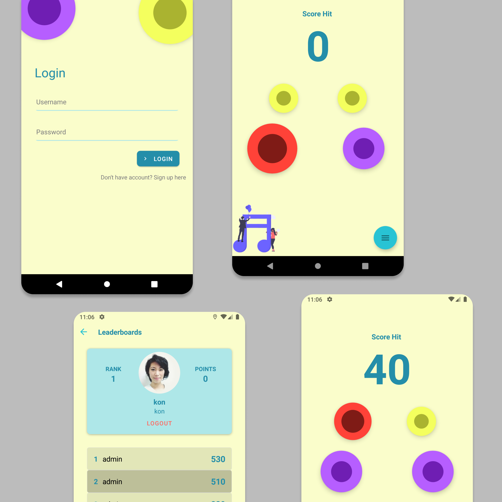

    <h1>Button Game</h1>

## Table of Contents

- [Table of Contents](#table-of-contents)
- [Introduction](#introduction)
- [Requirements](#requirements)
- [Usage](#usage)
- [Screenshoot](#screenshoot)
- [GIF](#gif)
- [Related Project](#related-project)

## Introduction

Button is a simple musical game made with React Native,
this game will increment the score if we tap the red button.

## Requirements

- `npm`
- `react-native-cli`

## Usage

- Clone or download this repo first
- Open your terminal or cmd and type `npm install` and `react-native link`
- After that, run backend first
- Connect your phone to the pc or laptop and make sure your phone is connected with debugging mode
- Finnaly, type `react-native run-android` and wait for the process to complete

## Screenshoot

## GIF

<iframe src="https://giphy.com/embed/S9iGtlb82dF9wLj7ew" width="100%" height="100%" style="position:absolute" frameBorder="0" class="giphy-embed" allowFullScreen></iframe>

  
## Related Project
 
* In this repository only for the frontend section, for the backend section can be seen [here](https://github.com/Drzaln/Button-Backend).